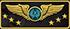

# Hello World 👋

My name is Cristian i'm a Full Stack developer since 2019. I love Javascript and learn new things. I always trying to do an organized and clean code.

### Find me  👇
 
&nbsp;
&nbsp;
&nbsp;
&nbsp;
&nbsp;
&nbsp;

 

  

  ### More about me
  🧘 I currently work with JavaScript and TDD. 
  🎮 I love play video-games, music and meet new things. 
  🔫 My best rank on CS:GO was Supreme Master First Class  
  🐞 Singing while code scares away bugs 
  🧘 I love incense

  

  

<!--   

 -->

